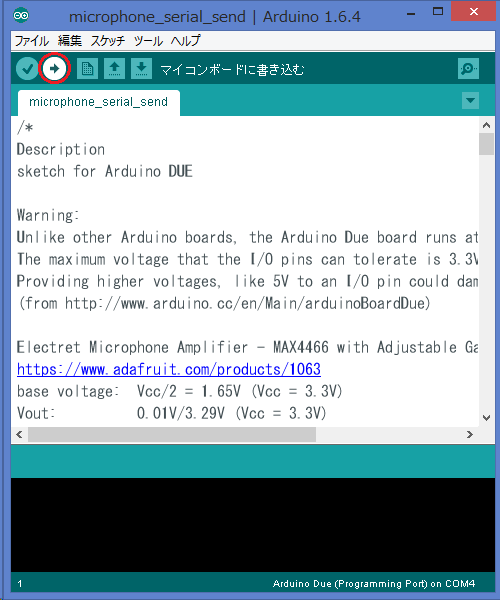

2015年7月21日

加藤　秀明

# Arduino DUEによるスペクトル測定プログラム

Windows8.1 64bit Python 3.4.3にて動作確認済み

目次

[TOC]

### セットアップ
1. 次のものを準備します
	- Arduino DUE
	- マイクロフォンモジュールMicrophone Amplifier 4466 with adjustable gain
	- ジャンパーケーブル
	- MicroUSB-USBケーブル
	- PC (Windows 8.1)

1. Aruduino　DUEとマイクロフォンモジュールを下の図のようにつなぎます。マイクロフォンモジュールのVccをArduino DUEの5V電源に、GNDをGND端子に、OUTをアナログ入力(A0)につなぎます。


1. Python3を	PCにインストールします。Python3の科学計算用ディストリビューションであるminicondaを使います。[http://conda.pydata.org/miniconda.html](http://conda.pydata.org/miniconda.html)からPython3のWindows版インストーラをダウンロードし、インストールしてください。


1. コマンドプロンプトを開き、Pythonのパッケージマネージャ(`pip`、`conda`)を使って以下のコマンドを入力して各種Pythonライブラリをインストールしてください。
```Python
conda install numpy scipy matplotlib
pip install PySide pyserial
```
各種ライブラリの概要は以下の通りです。
	- numpy			(FFTの計算)
	- matplotlib	(グラフの描画)
	- scipy			(matplotlibの依存ライブラリ)
	- PySide		(GUIアプリケーション作成のためのライブラリ)
	- pyserial		(シリアル通信ライブラリ)

1. Arduino IDEをPCにインストールします。[https://www.arduino.cc/en/main/software](https://www.arduino.cc/en/main/software)よりArduino IDEのWindows版インストーラをダウンロードし、インストールしてください。


### ディレクトリ構造

```
serial_plot
├─serial_plot.py(アプリケーション本体)
├─serial_plot_ui.py(GUI画面の書式)
└──microphone_serial_send
   └─microphone_serial_send.ino(Arduinoスケッチ)
```

`serial_plot.py`がアプリケーション本体です。
`serial_plot_ui.py`はGUIの書式を設定するためのファイルです。
`microphone_serial_send`ディレクトリ下にある`microphone_serial_send.ino`は、Arduino DUEのスケッチです。


### アプリケーションの操作


測定の手順
1. MicroUSB-USBケーブルでArduino DUEとPCをつなぎます。`serial_plot`フォルダをPCのホームディレクトリ(C:/Users/(ユーザー名))直下に移動します。

1. ArduinoがインストールされているPCを使います。ArduinoのアイコンをクリックしてArduino IDEを起動します。


1. 「ファイル>開く」を選択して`serial_plot>microphone_serial_send`フォルダ内の`microphone_serial_send.ino`を開きます。メニューバー下の右矢印「マイコンボードに書き込む」をクリックしてArduinoのプログラム(スケッチ)をArduino DUEにアップロードします。アップロードが終わるとAruduino DUEでプログラムが動作します。


1. 「コマンドプロンプト」を起動し、`cd C:\Users\(ユーザー名)\serial_plot`を打ち込んでディレクトリに移動します。`serial_plot`フォルダに移動します。`serial_plot.py`が本アプリケーション本体です。コマンドプロンプトおよびターミナルにて`Python serial_plot.py`を打ち込むとGUIアプリケーションが起動します。

1. 図1が起動直後のアプリケーションの操作画面です。「Control Panel」のラジオボタンをクリックして測定モードを変更します。測定モードはTrigerとFree Runの2つのモードがあります。Trigerモードは、Arduino DUEにつながれたマイクに一定の大きさの音が伝わった時に測定を行います。Free Runモードは測定開始直後にマイクの音を測定します。

図1. アプリケーションの起動画面

1. 「Run」ボタンをクリックすると測定が始まります。Arduino DUEのADCにつながれたマイクロフォンから20kHz感覚で2秒間のデータを測定します。データの測定は全体で約10秒かかります。

1. 測定を中断するときは「Stop」ボタンを押します。

1. 測定が終了すると、「RAW」および「FFT」パネル内のプロット領域にそれぞれマイクで測定された音とそれをFFT変換した振幅スペクトルが表れます。

図2. 測定終了後のアプリケーション画面

1. 測定終了後、「Save RAW」または「Save FFT」ボタンを押すと保存メニューが表れます。音のデータと振幅スペクトルのデータをdatファイルとして保存することができます。音声データは1列のテキストデータ、振幅スペクトルのデータは周波数と振幅をスペースで区切った2列のテキストデータとしてdatファイルで保存されます。


なお、以下の条件でアプリケーションの操作を行うと、警告ダイアログが表示されます。
・モードが選択されていない状態でRunボタンを押す
・測定が行われていない状態で「Save RAW」、「Save FFT」を押してデータの保存を行う
